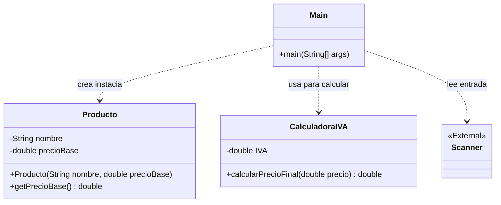

# Diagrama de clases

```mermaid
classDiagram
    class Producto {
        -String nombre
        -double precioBase
        +Producto(String nombre, double precioBase)
        +getPrecioBase() double
    }

    class CalculadoraIVA {
        -double IVA
        +calcularPrecioFinal(double precio) double
    }

    class Main {
        +main(String[] args)
    }

    class Scanner {
        <<External>>
    }

    Main ..> Producto : crea instacia
    Main ..> CalculadoraIVA : usa para calcular
    Main ..> Scanner : lee entrada
```
